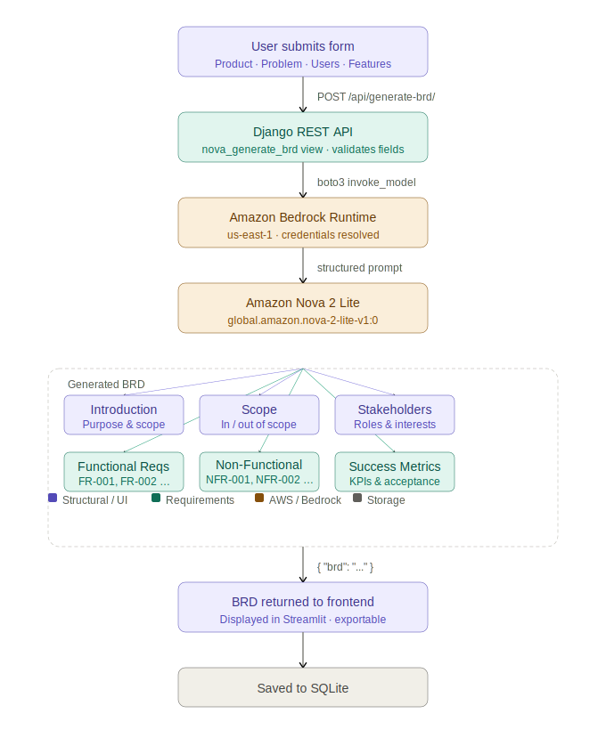

# BRD Generator – AI-Powered Business Requirements Document System

An intelligent Business Requirements Document (BRD) Generator built with Django, Machine Learning, Amazon Nova 2 Lite via Bedrock, and a Streamlit frontend. The system extracts, classifies, and organizes business requirements from unstructured sources such as emails, meeting notes, and documents into structured BRDs.

---

## Video Demo

https://youtu.be/gSs_GQdMHMs

---

## Workflow



---

## Project Overview

This system automates the process of:

- Extracting requirements from raw text sources
- Classifying them into:
  - Functional Requirements
  - Business Requirements
  - Non-Functional Requirements
- Assigning priorities (High / Medium / Low)
- Identifying stakeholders
- Generating structured BRD documents via **Amazon Nova 2 Lite** (Bedrock)

It significantly reduces manual documentation effort in software projects.

---

## Architecture

| Layer | Technology |
|-------|-----------|
| Frontend | Streamlit |
| Backend | Django + Django REST Framework |
| AI Generation | Amazon Nova 2 Lite via Amazon Bedrock |
| ML Layer | Scikit-learn / Transformers / Sentence-Transformers |
| Async Processing (optional) | Celery + Redis |
| Database | SQLite |

```
Streamlit Frontend
       │
       │  POST /api/generate-brd/
       ▼
Django REST API
       │
       │  boto3
       ▼
Amazon Bedrock Runtime
       │
       │  global.amazon.nova-2-lite-v1:0
       ▼
  Generated BRD
       │
       ▼
 SQLite Database
```

---

## Key Features

- Automated requirement extraction
- Requirement classification (FR / BR / NFR)
- Stakeholder identification
- Priority detection
- **AI-powered BRD generation via Amazon Nova 2 Lite**
- Admin dashboard
- Background ML processing (Celery optional)
- REST API architecture

---

## Tech Stack

- Python 3.8+
- Django 4.2
- Django REST Framework
- Amazon Bedrock (`global.amazon.nova-2-lite-v1:0`)
- boto3 / botocore
- Celery + Redis
- Scikit-learn
- Transformers
- Sentence-Transformers
- Streamlit
- SQLite

---

## Installation

See full setup instructions in **SETUP.md**.

Quick start:

```bash
python -m venv venv
source venv/bin/activate       # Windows: venv\Scripts\activate
pip install -r requirements.txt
cd backend
python manage.py migrate
python manage.py runserver
```

Then run the frontend:

```bash
python frontend/main.py
```

### AWS credentials (required for Nova 2 Lite)

Add the following to your `.env` file:

```env
AWS_ACCESS_KEY_ID=your_access_key_here
AWS_SECRET_ACCESS_KEY=your_secret_key_here
AWS_DEFAULT_REGION=us-east-1
```

Your IAM user or role needs the following permission:

```json
{
  "Effect": "Allow",
  "Action": "bedrock:InvokeModel",
  "Resource": "arn:aws:bedrock:*::foundation-model/amazon.nova-2-lite-v1:0"
}
```

---

## Nova 2 Lite Endpoint

Generate a BRD directly via the API:

```
POST /api/generate-brd/
```

```json
{
  "product_name":      "SmartInventory",
  "problem_statement": "Warehouses lack real-time stock visibility.",
  "target_users":      "Warehouse managers and operations staff",
  "key_features":      "Real-time tracking, low-stock alerts, reporting"
}
```

Returns a fully structured BRD with: Introduction, Scope, Stakeholders, Functional Requirements, Non-Functional Requirements, and Success Metrics.

---

## Project Structure

```
brd_generator_project/
├── backend/
│   ├── manage.py
│   ├── brd_backend/
│   ├── api/
│   │   ├── views.py          ← nova_generate_brd endpoint
│   │   └── urls.py           ← /api/generate-brd/ route
│   ├── ml_models/
│   │   └── nova_brd_generator.py   ← Bedrock + Nova 2 Lite integration
│   └── integrations/
├── frontend/
│   └── main.py
├── .env                      ← AWS credentials
├── requirements.txt          ← includes boto3
├── frontend_requirements.txt
├── SETUP.md
└── README.md
```

---

## Example Output

The system generates structured BRDs including:

- Executive Summary
- Business Objectives
- Stakeholder Analysis
- Functional Requirements (FR-001, FR-002, ...)
- Non-Functional Requirements (NFR-001, NFR-002, ...)
- Success Metrics

Automatically extracted from raw stakeholder communications and enriched by Nova 2 Lite.

---

## Notes

- ML models may download during first execution (~2–3 GB)
- Initial run may take several minutes
- Nova 2 Lite requires valid AWS credentials and Bedrock model access enabled in your region

---

## Assets

UI icons sourced from [remixicon.com](https://remixicon.com/)